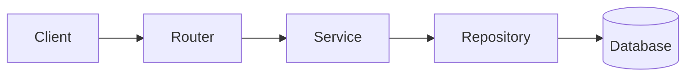

# Task Manager

   

An asynchronous RESTFul API for task management built with Python and FastAPI. This project was developed to practice modern backend development concepts, including layered architecture, JWT authentication, database modeling, and clean code organization.

*[Português Brasileiro](README_BR.md)*

---

# Contents:

- [What I Learned](#what-i-learned)
- [Features](#features)
- [Technologies](#technologies)
- [Architecture](#architecture)
- [Project Structure](#project-structure)
- [Installation](#installation)
- [API Documentation](#api-documentation)
- [Roadmap](#roadmap)
- [License](#license)

---

## What I Learned:

- Built a layered architecture;
- Applied the Repository Pattern and Service Layer to separate responsibilities;
- Implemented JWT authentication;
- Worked with asynchronous SQLAlchemy;
- Managed database migrations using Alembic.

---

## Features:

**Base URL:**
```
http://localhost:8000/api/v1
```

| Methods | Endpoints | Features |
| :------ | :-------- | :------------ |
| POST | `/auth/create` | Create a user |
| POST | `/auth/token` | Authentication using OAuth2 |
| POST | `/auth/refresh` | Refresh the expired access token |
| POST | `/auth/restore` | Restore a disabled account |
| GET | `/users/me` | Retrieve the user's information |
| PATCH | `/users/update` | Update the user's name and e-mail |
| PATCH | `/users/update/password` | Updated the user's password |
| DELETE | `/users/delete` | Soft-delete the user account |
| POST | `/tasks/create` | Create a task |
| GET | `/tasks/list` | List all of the user's tasks |
| PATCH | `/tasks/update/{task_id}` | Update task's title and descriptions |
| PATCH | `/tasks/update/status/{task_id}` | Update a task's status |
| DELETE | `/tasks/delete/{task_id}` | Soft-delete a task |
| GET | `/tasks/bin` | List all deleted tasks |
| PATCH | `/tasks/restore/{task_id}` | Restore a deleted tasks |
| DELETE | `/tasks/delete/bin` | Delete all tasks in the recycle bin |

---

## Technologies:

| Technology  | Purpose |
| :---------- | :------ |
| Python 3.14 | Programming language |
| FastAPI | Web Framework |
| SQLAlchemy | ORM |
| Alembic | Database migrations |
| SQLite | Database |
| Aiosqlite | Asynchronous SQLite driver |
| Argon2 | Password Hashing |
| PyJWT | JWT authentication |

---

## Architecture:



---

## Project Structure:

```
.
├── alembic/
│   ├── versions/
│   ├── env.py
│   └── script.py.mako
│
├── src/
│   ├── core/           # Global configurations
│   │   ├── config.py
│   │   ├── database.py
│   │   ├── exceptions.py
│   │   └── security.py
│   │
│   ├── tasks/          # Task layer
│   │   ├── dependencies.py
│   │   ├── enums.py
│   │   ├── exceptions.py
│   │   ├── models.py
│   │   ├── repository.py
│   │   ├── router.py
│   │   ├── schemas.py
│   │   └── service.py
│   │
│   ├── users/          # User layer
│   │   ├── routers/
│   │   │   ├── __init__.py
│   │   │   ├── auth_router.py
│   │   │   └── user_router.py
│   │   │
│   │   ├── dependencies.py
│   │   ├── exceptions.py
│   │   ├── models.py
│   │   ├── repository.py
│   │   ├── schemas.py
│   │   └── service.py
│   │
│   └── main.py
│
├── tests/
│   ├── core/
│   │   └── test_security.py
│   │
│   ├── tasks/
│   │   ├── factories.py
│   │   ├── test_router.py
│   │   └── test_tschemas.py
│   │
│   ├── users/
│   │   ├── routers/
│   │   │   ├── test_auth.py
│   │   │   └── test_user.py
│   │   │
│   │   ├── factories.py
│   │   └── test_uschemas.py
│   │
│   └── conftest.py
│
├── .env
├── alembic.ini
├── README_BR.md
├── README.md
└── requirements.txt
```

---

## Installation:

### Prerequisites:
- Python installed on your machine.

### Step by Step:

1. **Clone the Repository:**

```bash
    git clone https://github.com/ruanmarvila/gerenciador-tarefas
```

2. **Create a virtual environment:**

```bash
    python -m venv .venv

    # Windows:
    .venv\Scripts\Activate.ps1

    # Linux or Mac:
    source .venv/bin/activate
```

3. **Install the dependencies:**

```bash
    pip install -r requirements.txt
```

4. **Configure the environment variables:**

- Create a `.env` file in the project root:

```properties
SECRET_KEY=your_secret_key_here
ALGORITHM=HS256
ACCESS_TOKEN_EXPIRE_MINUTES=30
```

5. **Run the migrations:**
```bash
    alembic upgrade head
```

6. **Start the server:**
```bash
    uvicorn src.main:app --reload
```

---

## API Documentation:

FastAPI automatically generates interactive API documentation. Once the server is runing, you can access and test the endpoints at:
- Swagger UI: http://localhost:8000/docs
- Redoc: http://localhost:8000/redoc

---

### Examples of Request and Response:

```http
POST /auth/create
```

1. **Request:**
```json
{
    "name": "Ana",
    "email": "ana@gmail.com",
    "password": "12345678"
}
```

2. **Response (`201 CREATED`):**
```json
{
    "name": "Ana",
    "email": "ana@gmail.com"
}
```

---

## Roadmap:

- [ ] Unit tests
- [ ] Integration tests
- [ ] Docker
- [ ] PostgreSQL

---

## License:

This project is licensed under the MIT License.