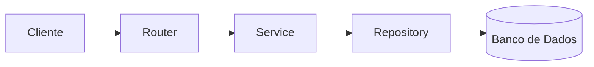

# Gerenciador de Tarefas:

   

Uma API RESTful assíncrona para gerenciamento de tarefas desenvolvida com Python e FastAPI. O projeto foi criado com foco em aprendizado de desenvolvimento backend moderno, arquitetura em camadas, autenticação JWT, modelagem de banco de dados e boas práticas de organização de código.

---

# Índice

- [O que Aprendi](#o-que-aprendi)
- [Funcionalidades](#funcionalidades)
- [Tecnologias Utilizadas](#tecnologias-utilizadas)
- [Arquitetura](#arquitetura)
- [Estrutura do Projeto](#estrutura-do-projeto)
- [Como executar](#como-executar)
- [Documentação da API](#documentação-da-api)
- [Próximos passos](#próximos-passos)
- [Licença](#licença)

---

## O que aprendi

- Estruturar utilizando arquitetura em camadas;
- Separar responsabilidades através de *Repository Pattern* e *Service Layer*;
- Implementar autenticação JWT;
- Utilizar SQLAlchemy assíncrono
- Gerenciar migrações de banco de dados com Alembic.

---

## Funcionalidades:

**URL Base:**
```
http://localhost:8000/api/v1
```

| Método  | Endpoints                        | Funcionalidade                     |
| :------ | :------------------------------- | :--------------------------------- |
| POST    | `/auth/create`                   | Cria um usuário                    |
| POST    | `/auth/token`                    | Login via OAuth2                   |
| POST    | `/auth/refresh`                  | Renova o *access token* expirado   |
| POST    | `/auth/restore`                  | Restaura uma conta desativada      |
| GET     | `/users/me`                      | Retorna os dados do usuário        |
| PATCH   | `/users/update`                  | Atualiza nome e e-mail             |
| PATCH   | `/users/update/password`         | Atualiza a senha                   |
| DELETE  | `/users/delete`                  | *Soft delete* da conta             |
| POST    | `/tasks/create`                  | Cria uma tarefa                    |
| GET     | `/tasks/list`                    | Lista todas as tarefas do usuário  |
| PATCH   | `/tasks/update/{task_id}`        | Atualiza título e descrição        |
| PATCH   | `/tasks/update/status/{task_id}` | Atualiza o status                  |
| DELETE  | `/tasks/delete/{task_id}`        | *Soft delete* de uma tarefa        |
| GET     | `/tasks/bin`                     | Lista todas as tarefas na lixeira  |
| PATCH   | `/tasks/restore/{task_id}`       | Restaura uma tarefa da lixeira     |
| DELETE  | `/tasks/delete/bin`              | Deleta todas as tarefas da lixeira |

---

## Tecnologias Utilizadas:

| Tecnologia  | Finalidade        |
| :---------- | :---------------- |
| Python 3.14 | Linguagem         |
| FastAPI     | Framework Web     |
| SQLAlchemy  | ORM               |
| Alembic     | Migrações         |
| SQLite      | Banco de Dados    |
| Aiosqlite   | Driver assíncrono |
| Argon2      | Hash de senhas    |
| PyJWT       | Autenticação JWT  |

---

## Arquitetura:



---

## Estrutura do Projeto:
```
.
├── alembic/
│   ├── versions/
│   ├── env.py
│   └── script.py.mako
│
├── src/
│   ├── core/           # Configurações compartilhadas
│   │   ├── config.py
│   │   ├── database.py
│   │   ├── exceptions.py
│   │   └── security.py
│   │
│   ├── tasks/          # Domínio das tarefas
│   │   ├── dependencies.py
│   │   ├── enums.py
│   │   ├── exceptions.py
│   │   ├── models.py
│   │   ├── repository.py
│   │   ├── router.py
│   │   ├── schemas.py
│   │   └── service.py
│   │
│   ├── users/          # Domínio de usuários
│   │   ├── routers/
│   │   │   ├── __init__.py
│   │   │   ├── auth_router.py
│   │   │   └── user_router.py
│   │   │
│   │   ├── dependencies.py
│   │   ├── exceptions.py
│   │   ├── models.py
│   │   ├── repository.py
│   │   ├── schemas.py
│   │   └── service.py
│   │
│   └── main.py         # Inicialização da aplicação
│
├── tests/
│   ├── core/
│   │   └── test_security.py
│   │
│   ├── tasks/
│   │   ├── factories.py
│   │   ├── test_router.py
│   │   └── test_tschemas.py
│   │
│   ├── users/
│   │   ├── routers/
│   │   │   ├── test_auth.py
│   │   │   └── test_user.py
│   │   │
│   │   ├── factories.py
│   │   └── test_uschemas.py
│   │
│   └── conftest.py
│
├── .env
├── alembic.ini
├── README.md
└── requirements.txt
```

---

## Como Executar:

### Pré-requisitos:
- Python instalado na máquina.

### Passo a Passo:

1. **Clone o Repositório:**

```bash
    git clone https://github.com/ruanmarvila/gerenciador-tarefas
```

2. **Crie um ambiente virtual:**

```bash
    python -m venv .venv

    # Windows:
    .venv\Scripts\Activate.ps1

    # Linux ou Mac:
    source .venv/bin/activate
```

3. **Instale as dependências:**

```bash
    pip install -r requirements.txt
```

4. **Configure as variáveis de ambiente:**

- Crie um `.env` na raiz do projeto

```properties
    SECRET_KEY=sua_chave_secreta_aqui
    ALGORITHM=HS256
    ACCESS_TOKEN_EXPIRE_MINUTES=30
```

5. **Rode as migrações:**
```bash
    alembic upgrade head
```

6. **Inicie o servidor:**
```bash
    uvicorn src.main:app --reload
```

---

## Documentação da API:

O FastAPI cria automaticamente uma documentação interativa. Com o servidor rodando, você pode acessar e testar os endpoints através dos links:
- Swagger UI: http://localhost:8000/docs
- Redoc: http://localhost:8000/redoc

### Exemplos de Requisições e Respostas:

```http
POST /auth/create
```

1. **Requisição:**
```json
{
    "name": "Ana",
    "email": "ana@gmail.com",
    "password": "12345678"
}
```

2. **Resposta Esperada (`201 CREATED`):**
```json
{
    "name": "Ana",
    "email": "ana@gmail.com"
}
```

---

## Próximos Passos:

- [ ] Testes unitários
- [ ] Testes de Integração
- [ ] Docker
- [ ] PostgreSQL
- [ ] Fazer lógica de recuperação dos 30 dias
- [ ] Fazer RefreshTokenBearer

---

## Licença:

Este projeto está sob a licença MIT.